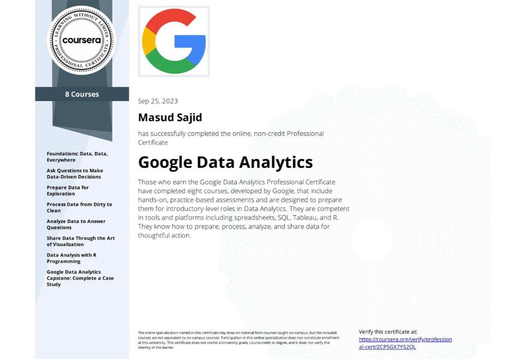
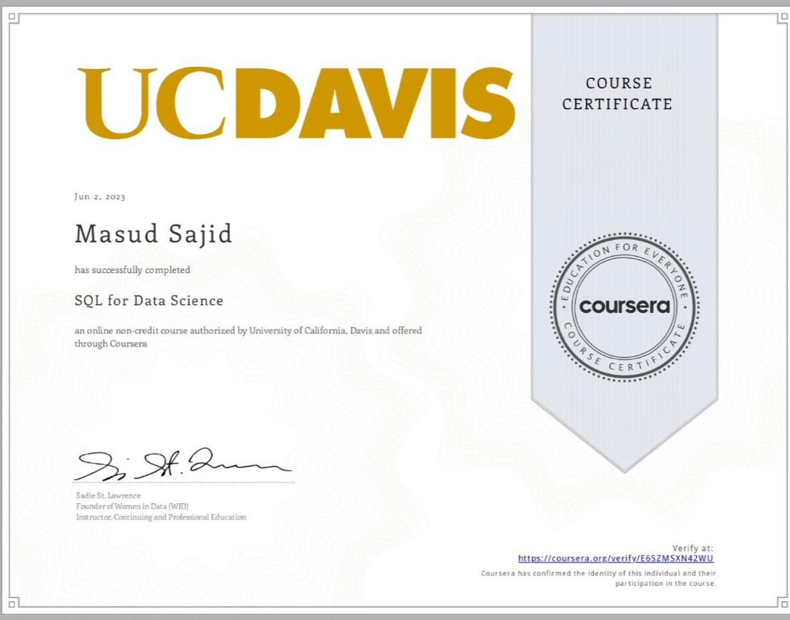
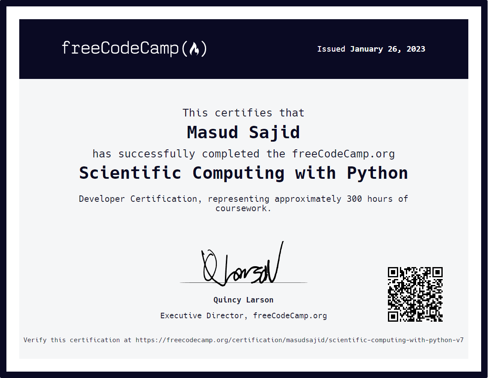

<h1 align="center">Hi 👋, I'm Masud</h1>
<h3 align="center">A passionate Data Analyst from Pakistan</h3>

  

  

- 🌱 I’m currently learning **ETL in Python, SSIS**

- 👨‍💻 All of my projects are available at [https://github.com/masudsajid](https://github.com/masudsajid)

- 💬 Ask me about **SQL, R, Excel, Power BI, C++, Python**

- 📫 How to reach me **masudsajid38@gmail.com**

- 📄 Know about my experiences [https://github.com/masudsajid/Resume](https://github.com/masudsajid/Resume)

<h3 align="left">Connect with me:</h3>

# Certifications

